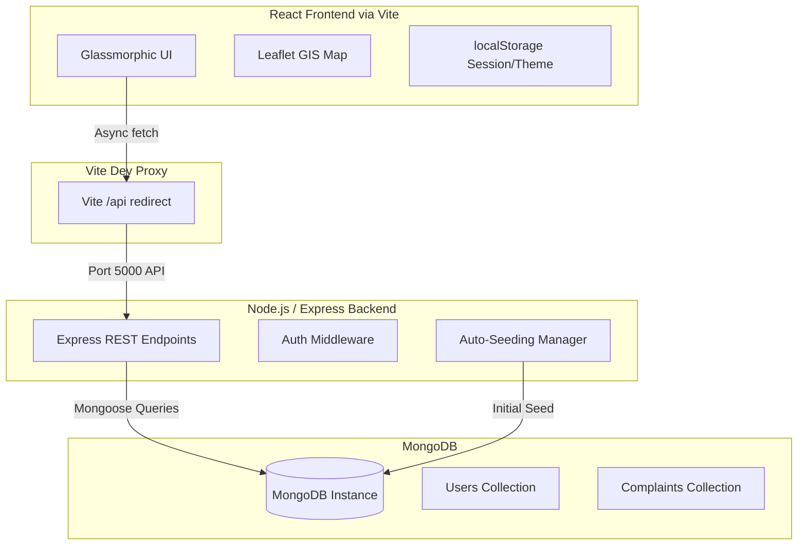
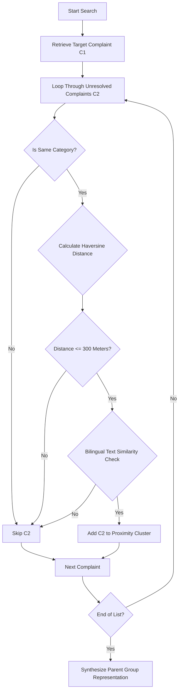
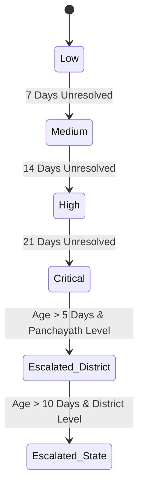

# 👁️ Urban-Eye
## Full System Architecture, Database Schemas & Complex Algorithm Documentation

Urban-Eye is a next-generation, high-fidelity municipal grievance platform designed for citizens and administrative authorities in Kerala. This document serves as the absolute technical manual for the project, detailing system architecture, database models, security frameworks, and the implementation details of all complex backend/frontend mechanisms.

---

## 🗺️ 1. High-Level System Architecture

Urban-Eye uses a modern **3-Tier Web Application Architecture** built upon React, Node.js, Express, and MongoDB, tied together with a local proxy server.



### Flow of Data:
1. **Frontend to API**: The client-side React app targets `/api/*` endpoints. In development, the Vite server configures a reverse proxy to forward requests to `http://127.0.0.1:5000/api/*` without causing Cross-Origin Resource Sharing (CORS) blocks.
2. **Data Sanitization**: Upon fetching complaints from the database API, the React app maps all payloads through `sanitizeComplaint()` in [storage.js](file:///c:/Users/AAYAS/OneDrive/Desktop/project/Urban-Eye/src/utils/storage.js#L118), upgrading legacy data models and validating coordinates dynamically to prevent runtime UI crashes.
3. **Database Layer**: Express connects to MongoDB via Mongoose. If collections are empty on startup, default users and Malayalam/English complaints are auto-seeded.

---

## 🗄️ 2. Database Schemas (Mongoose / MongoDB)

Persistence was migrated from volatile client-side `localStorage` to **MongoDB** using Mongoose schemas. Below are the precise database structures utilized:

### 2.1 User Collection Schema (`User`)
Stores citizen profiles and departmental/regional administrators:
```javascript
const UserSchema = new mongoose.Schema({
  name: { type: String, required: true },
  username: { type: String, required: true, unique: true, index: true },
  password: { type: String, required: true },
  role: { type: String, required: true } // e.g. "citizen", "PANCHAYATH_ROAD_ADMIN", "admin"
});
```

### 2.2 Complaints Collection Schema (`Complaint`)
A comprehensive representation storing coordinates, details, and dynamic logs:
```javascript
const CommentSchema = new mongoose.Schema({
  id: String,
  user: String,
  text: String,
  time: String
});

const EscalationLogSchema = new mongoose.Schema({
  timestamp: Number,
  byUser: String,
  details: String
});

const ComplaintSchema = new mongoose.Schema({
  id: { type: String, required: true, unique: true, index: true },
  category: String,             // e.g. "pothole", "waste", "streetlight", "waterlogging"
  titleEn: String,
  titleMl: String,
  descEn: String,
  descMl: String,
  location: String,             // User-facing street address string
  district: String,             // 3-letter district code, e.g. "MPM", "EKM", "TVM"
  lat: Number,                  // Geolocation Latitude
  lng: Number,                  // Geolocation Longitude
  image: String,                // Base64-encoded image payload or Unsplash fallback URL
  createdAt: Number,            // Epoch timestamp of ticket creation
  status: String,               // e.g. "submitted", "reviewed", "scheduled", "resolved"
  seriousness: String,          // Current priority: "low", "medium", "high", "critical"
  originalSeriousness: String,  // Seriousness at submission (used by Aging Engine)
  citizen: String,              // Submitting citizen's full name
  upvotes: Number,
  upvotedBy: [String],          // List of usernames who upvoted (anti-spam restriction)
  comments: [CommentSchema],
  hierarchyLevel: String,       // Current escalation level: "panchayath", "district", "state"
  originalHierarchyLevel: String,
  assignedDepartment: String,   // Assigned sector, e.g. "Road", "Water", "Electricity"
  escalationStatus: String,     // e.g. "none", "auto", "manual"
  escalationLogs: [EscalationLogSchema],
  agingResetLog: [mongoose.Schema.Types.Mixed],
  simulatedDaysAtCreation: Number, // Offset recording simulation state when filed
  scheduledDate: String,
  resolvedDate: String,
  resolutionNotes: String,
  resolutionImage: String,      // Base64 resolution proof
  assignedTeam: String,         // Dispatch squad name
  technicianName: String,
  technicianPhone: String
});
```

---

## 🧮 3. Implementation Details of Complex Subsystems & Algorithms

### 3.1 Geographical Proximity Routing & Clustering Optimizer
When an administrator is reviewing a complaint, the portal dynamically scans for adjacent issues to optimize route dispatch schedules (batching tasks). 



#### A. The Haversine Distance Formula
Calculates the shortest distance over the Earth's curved surface between coordinates ($lat_1$, $lng_1$) and ($lat_2$, $lng_2$) in meters:
$$\Delta lat = (lat_2 - lat_1) \times \frac{\pi}{180}$$
$$\Delta lng = (lng_2 - lng_1) \times \frac{\pi}{180}$$
$$a = \sin^2\left(\frac{\Delta lat}{2}\right) + \cos\left(lat_1 \times \frac{\pi}{180}\right) \times \cos\left(lat_2 \times \frac{\pi}{180}\right) \times \sin^2\left(\frac{\Delta lng}{2}\right)$$
$$c = 2 \times \text{atan2}\left(\sqrt{a}, \sqrt{1-a}\right)$$
$$\text{Distance} = R \times c \quad (\text{where } R = 6,371,000 \text{ meters})$$

*Javascript Implementation:*
```javascript
export function calculateDistanceMeters(lat1, lng1, lat2, lng2) {
  const R = 6371000;
  const dLat = (lat2 - lat1) * Math.PI / 180;
  const dLng = (lng2 - lng1) * Math.PI / 180;
  const a = 
    Math.sin(dLat / 2) * Math.sin(dLat / 2) +
    Math.cos(lat1 * Math.PI / 180) * Math.cos(lat2 * Math.PI / 180) * 
    Math.sin(dLng / 2) * Math.sin(dLng / 2);
  const c = 2 * Math.atan2(Math.sqrt(a), Math.sqrt(1 - a));
  return R * c;
}
```

#### B. NLP Jaccard and Overlap Text Similarity Engine
To ensure complaints are describing the same core issue (e.g. "pothole on road" vs "broken road surface"), titles and descriptions are tokenized and processed. This engine supports **Malayalam Unicode characters** (`\u0D00-\u0D7F`) alongside English.
- **Jaccard Index**: Measures the size of the intersection divided by the size of the union of the token sets:
$$J(S_1, S_2) = \frac{|S_1 \cap S_2|}{|S_1 \cup S_2|}$$
- **Overlap Coefficient**: Measures intersection relative to the smaller set, correcting cases where one description is much shorter:
$$\text{Overlap}(S_1, S_2) = \frac{|S_1 \cap S_2|}{\min(|S_1|, |S_2|)}$$

*Javascript Implementation:*
```javascript
export function areTextsSimilar(str1, str2) {
  if (!str1 || !str2) return false;
  const clean1 = str1.toLowerCase().trim();
  const clean2 = str2.toLowerCase().trim();
  if (clean1 === clean2) return true;

  // Malayalam Unicode preservation regex (\u0D00-\u0D7F)
  const getTokens = (str) => str.toLowerCase()
    .replace(/[^\w\s\u0D00-\u0D7F]/g, "")
    .split(/\s+/)
    .filter(w => w.length > 1);

  const t1 = getTokens(clean1);
  const t2 = getTokens(clean2);
  if (t1.length === 0 || t2.length === 0) return false;

  const s1 = new Set(t1);
  const s2 = new Set(t2);
  let intersection = 0;
  for (const w of s1) {
    if (s2.has(w)) intersection++;
  }
  const jaccard = intersection / new Set([...t1, ...t2]).size;
  const overlap = intersection / Math.min(s1.size, s2.size);

  return jaccard > 0.12 || overlap > 0.30;
}
```

#### C. Synthesizing Representative Groups
When complaints are clustered (Distance $\le 300$ meters, same category, similar descriptions):
- **Upvote Aggregation**: The upvotes of the unified group card display as the **sum of all children's upvotes**.
- **Priority Elevation**: The group inherits the **highest priority level** found among its child issues to ensure critical items dictate urgency:
```javascript
const PRIORITY_VALUES = { low: 1, medium: 2, high: 3, critical: 4 };
const getHighestPriority = (children) => {
  let highest = "low";
  let maxVal = 0;
  children.forEach(c => {
    const val = PRIORITY_VALUES[c.seriousness] || 1;
    if (val > maxVal) {
      maxVal = val;
      highest = c.seriousness;
    }
  });
  return highest;
};
```
- **Coordinated Action Dispatch**: When an administrator updates a group complaint (e.g. scheduling dispatch, assigning a team, or resolving the issue), the update is applied atomically to all underlying children in the MongoDB collection, ensuring that resolution or updates cascade correctly.

---

## ⏳ 4. Dynamic Starvation Prevention & Time-Warp Aging Engine
To prevent minor reports (e.g. low-priority streetlights) from being ignored indefinitely by dispatch crews, an **Automated Starvation Prevention Engine** acts on unresolved tickets during loading.



### 4.1 Priority & Seriousness Progression
For every 7 simulated days that a ticket sits unresolved, it progresses up one priority tier:
$$\text{Priority Step} = \lfloor \text{Simulated Age (Days)} / 7 \rfloor$$
- **Low** $\rightarrow$ **Medium** $\rightarrow$ **High** $\rightarrow$ **Critical**

### 4.2 Autonomous Governance Escalation Gates
If tickets sit unmanaged across local jurisdictions for prolonged periods, they bypass local administrators and auto-escalate to higher authorities:
- **Age > 5 Days**: Auto-escalated from **Panchayath** level to **District** level.
- **Age > 10 Days**: Auto-escalated from **District** level to **State** level.
- A system-automated log is attached to the ticket detailing the cause of escalation.

---

## 🔑 5. Administrative Scoped Filtering & Roles
Authentication levels control access to dashboards, maps, and administrative capabilities:

| Role Name | Authority Level | Sector/Department | Visible Data Scope |
| :--- | :--- | :--- | :--- |
| `citizen` | None | None | Public feed, own complaints, and upvoting actions. |
| `PANCHAYATH_ROAD_ADMIN` | Panchayath | Road | Localized street/pothole issues inside the local Panchayath. |
| `DISTRICT_HEALTH_ADMIN` | District | Health | District-wide clinics, sanitization, and health complaints. |
| `STATE_WATER_ADMIN` | State | Water | State-wide view of waterlogged roads and canal reports. |
| `admin` (Super Admin) | Super User | All | State-wide view of all sectors, database controls, and bypasses. |

#### Role Parser Logic
Admin roles are parsed dynamically to extract hierarchical level and department scope:
```javascript
export const getAdminInfoFromRole = (role) => {
  if (!role) return null;
  if (role === "admin" || role === "ADMIN") return { isSuperAdmin: true };
  
  const parts = role.toUpperCase().split("_");
  if (parts.length >= 3 && parts[parts.length - 1] === "ADMIN") {
    const levelStr = parts[0];
    const deptStr = parts.slice(1, parts.length - 1).join("_");
    
    const level = HIERARCHY_LEVELS[levelStr] || HIERARCHY_LEVELS.PANCHAYATH;
    const department = DEPARTMENTS[deptStr] || DEPARTMENTS.OTHER;
    
    return { level, department, isSuperAdmin: false };
  }
  return null;
};
```

---

## 📷 6. Media Storage: Base64 Serialization
To bypass server disk storage limitations and handle base64 image strings cleanly, citizens' media uploads and administrators' resolution images are converted into Base64 strings.
- **Conversion Flow**:
  1. The user drags a file into the Dropzone of the report modal.
  2. The browser loads the file in a `FileReader` instance:
     ```javascript
     const reader = new FileReader();
     reader.readAsDataURL(file);
     reader.onload = () => {
       const base64String = reader.result;
       // Save to React State -> Sync to MongoDB via PUT/POST payload
     };
     ```
  3. The resulting string is saved directly as a `String` property in Mongoose.
  4. The server limits maximum JSON payloads to `50mb` in `server.js` to handle multiple photos in a single request:
     ```javascript
     app.use(express.json({ limit: "50mb" }));
     ```

---

## 📊 7. Handcrafted Responsive SVG Analytics

Urban-Eye uses pure inline SVGs (no external chart libraries like Chart.js or Recharts) to render responsive data visualization components.

### 7.1 SVG Bar Chart (Grievances by Category)
Calculates category totals, determines the maximum frequency to set the Y-axis scale, and maps each entry into responsive `<rect>` bars, `<text>` labels, and axes.

### 7.2 SVG Radial Segment Donut Chart (Lifecycle Statuses)
Determines the relative percentages of each ticket status (`submitted`, `reviewed`, `scheduled`, `resolved`), and computes the circular stroke dash arrays.
- **Calculations**:
  - Circle radius ($r$) = $50$ units.
  - Circumference ($C$) = $2\pi r \approx 314.159$ units.
  - For each status percentage ($p$):
    $$\text{Stroke Dasharray} = (C \times p, C)$$
    $$\text{Stroke Offset} = C - (\text{cumulative percentage} \times C)$$
- **SVG rendering**:
  ```xml
  <circle
    cx="100" cy="100" r="50"
    fill="transparent"
    stroke={statusColor}
    strokeWidth="20"
    strokeDasharray="94.24 314.15"
    strokeDashoffset="314.15"
  />
  ```

---

## ⚡ 8. Verification, Deployment & Launch Guidelines

### 8.1 Installation & Startup
```bash
# 1. Install root & server dependencies
npm install
cd server
npm install
cd ..

# 2. Start the Backend Mongo Server (Port 5000)
cd server
npm run dev

# 3. Start the Vite Frontend (Port 5173 with proxy)
# (In a separate terminal window)
npm run dev
```

### 8.2 Production Build Validation
```bash
# Validate that zero compile warnings or chunk issues occur
npm run build
```
The client bundles are cleanly generated inside the `/dist` directory.
